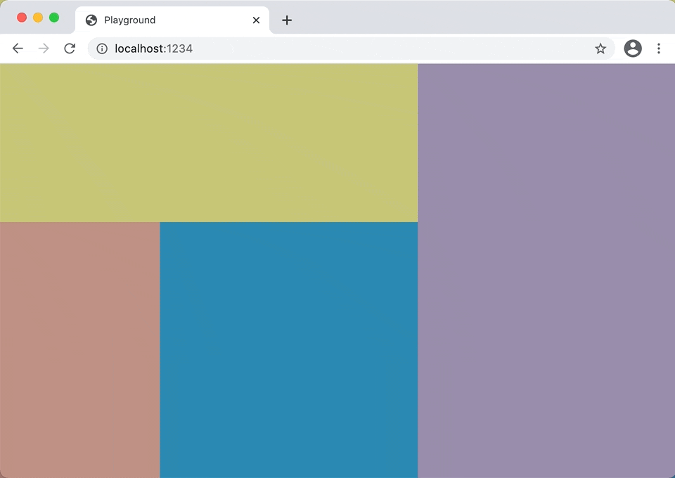

# split-view



A simple split view for react.

## install

```bash
npm i @eyhn/split-view
```

## example

```jsx
const [size, setSize] = useState<number[]>([100, 200] /* default size for each part */)

return (
  <SplitView
    minSize={[40, 20]} // minimum size for each part
    size={size} // current size for each part, is a array of numbers
    onSizeChange={setSize} // event on size change, will be fired by mouse dragging
    width={400} // width of split view
    height={400} // height of split view
    grow={[1, 1]} // like 'flex-grow', specifies how much of the remaining space in the split container should be assigned to each part
    direction='row' // split view direction
  >
    {/* each child node will be part of the split view. */}
    <div style={{ width: '100%', height: '100%' }}>YOUR CONTENT HERE</div>
    {/* function child nodes can get width and height through parameters  */}
    {(width, height) => <div style={{ width, height }}>YOUR CONTENT HERE</div>}
  </SplitView>
)
```

See more details in [example.tsx](./src/example.tsx).
